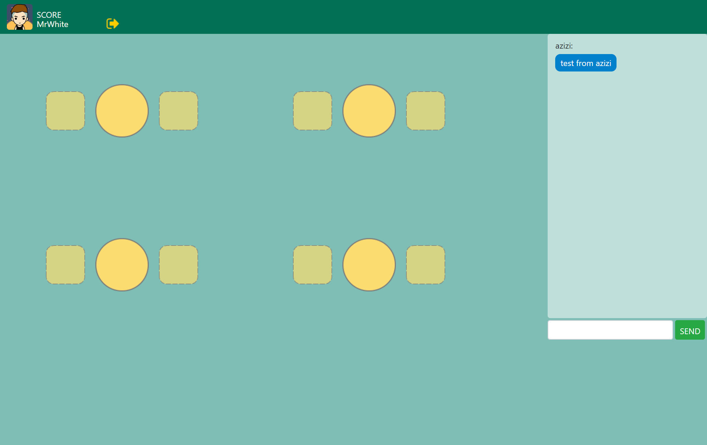
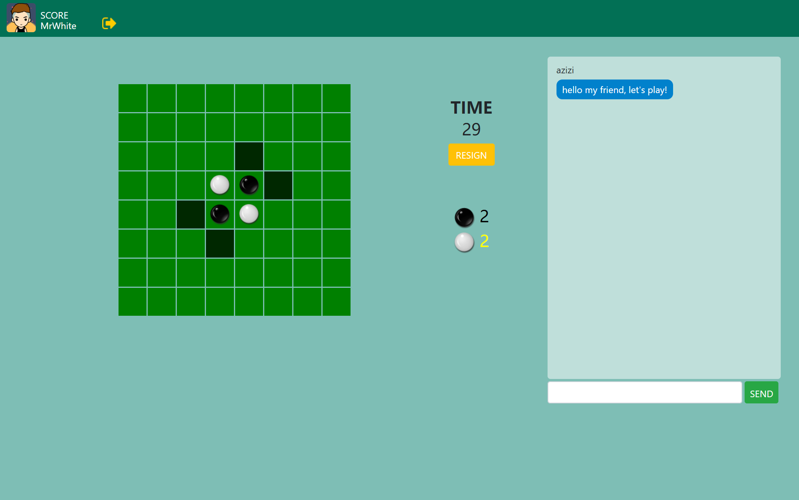
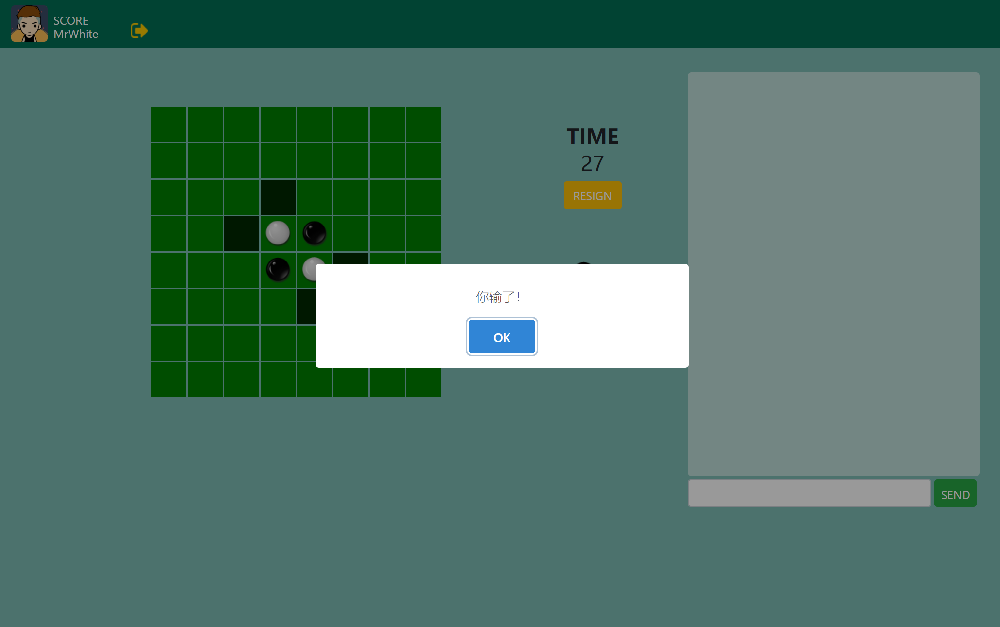

#黑白棋


| 协力者                                        | 模块                                                         |
| --------------------------------------------- | ------------------------------------------------------------ |
| [lvjingzhi](https://github.com/lvjingzhi)     | 前端页面编写，UI设计，黑白棋模块编写                         |
| [duskcloudxu](https://github.com/duskcloudxu) | 框架搭建，数据库连接，socketio连接，后台逻辑编写，前台和后台逻辑有关的接口编写 |

介绍：这是一个基于socket.io实现的多人黑白棋网络对战游戏。


##使用说明
下载完成后运行在cmd中运行一下代码来安装依赖
```
npm install
```
##编辑说明
登陆界面为：
```
http://localhost:3000/
```
大厅界面为：
```
http://localhost:3000/lobby
```
游戏界面为：
```
http://localhost:3000/game
```
目前进度为这三者的前端页面编辑以及后面的逻辑实现。
具体bootstrap,Jquery的使用案例请参考test.hbs这个模板

（但是javascript记得分到public下的文件夹对每个页面单独写一个）
##TODOLIST:
- jquery 双向绑定 [使用场景有限]
- 密码加密存储[加个hash就行了感觉没啥具体意义]
- 注册字符检查
- 正则优化注册检查[完成 by lvJingzhi]
- 增加上传头像功能 [实现js文件路径为: public/lib/cropperClipping/clippingTool.js]
- 路由规范[solved]
- 前端离开当前网页的提示[没有什么实际意义]
- 图片上传[由于神奇的post链接数据丢失问题导致没有完成]
##感想
###mongoose的数据库链接真的是贴心到气人：
```
model = mongoose.model('user', users);
```
连接到的是名为"users"的表
```
model = mongoose.model('users', users);
```
连接到的是名为"users"的表
```
model = mongoose.model('userssss', users);
```
连接到的是名为"usersssses"的表

我真的是 谢谢你啊。
### socket.io的感想
- 对于一个特定客户端的特定标志引发的on监听事件，若在该事件作用域内进行任何标志的emit，则只有发送信息的客户端的相关标志监听事件能够收到，这样说可能很绕口，让我们来看看样例：

服务器端：
```javascript
io.on('connection', (socket) => {
  console.log("A member connected");
  socket.on("disconnect", () => {
    console.log("A member disconnected");
  });
  socket.on('chatMessage', (msg) => {
    console.log(msg);
    // socket.emit('chatMessageClient',msg);
    socket.broadcast.emit('chatMessageClient',msg);
  })
});
```
客户端：
```javascript
socket = io();
$("#send").click(() => {
  	console.log($("#chatMessage").val());
 	socket.emit('chatMessage', $("#chatMessage").val());
});
  socket.on("chatMessageClient", (msg) => {
  	console.log(msg);
 	$('#chatBoard').append($('<li>').text(msg));
})
```
代码如上，重点在
```javascript
socket.on('chatMessage', (msg) => {
    console.log(msg);
    // socket.emit('chatMessageClient',msg);
    socket.broadcast.emit('chatMessageClient',msg);
  })
```
这里，如果我们用的是被注释的那一行，那么只有触发这个标志的客户端，就叫A好了，客户端A才会通过代码的

```javascript
 socket.on("chatMessageClient", (msg) => {
  	console.log(msg);
 	$('#chatBoard').append($('<li>').text(msg));
})
```

收到emit中的msg内容，而

```javascript
socket.broadcast.emit('chatMessageClient',msg);
```

恰恰相反，它会让所有非A的连接到客户端的机器收到msg。

- socket的刷新

  socket对象会在页面进行刷新或者转换的时候掉线，然后转换到game界面的时候调用了原来user2socket对应的socket链接，然后就悲剧的debug了半个小时……


##代码审查：
- 发现bug若干
- 发现ID和需求对不上号若干
- 发现less文件写的过于繁琐
- 发现变量定义不明

解决方案：
  为了帮助某些人养成良好的代码习惯，又考虑到现在socketIO正在卡壳，前端的工作基本完成，现要求：
  - 使用Less的嵌套方法重新优化样式表文件
  - 使用小驼峰命名法重新书写变量
  - 使用bootstrap优化原页面，取出不必要的ID绑定和DOM结构。

## 和需求不一样的地方

经过考虑，打算将原定的：由服务器完成全部计算 改成 服务器记录初始状态，在每一步进行验证，若验证不成功，则返回错误，并自动将该局判负。 

目前先实现对用户返回数据绝对信任的模型，因为黑白棋模块缺乏实际可用的API,没有很好的做到模块化，这个下次要注意。

## 游戏的具体实现

先通过用户登录来取得当前用户的名称，放在cache里面（事实上这一步可以做一个服务器返回秘钥，但是先把主体搭好再说），通过取得cache知道当前用户名，通过当前用户名来实现聊天室功能，通过当前用户名维护roomList,即前端通过socketio在roomList有更新的时候更新前端画面，然后当用户点击前端对应的座位的时候更新后端信息。

当两个座位上都坐满了以后，双方在都点击了准备的情况下会跳转进对局页面。（在roomList里面的数据里加一个ready项）综上所述，roomList的格式应该为：

roomList={

​	{

​		player:["MrWhite","MrBlack"],

​		checked:[true,false]//代表第一个玩家准备好了，第二个玩家没有准备好。

​	}

}

## 感想
- socket建立的不同标志的链接实在是有点多，这个结构个人觉得存在优化的可能性。

  - 到目前位置探究出来的一个技巧：
    - 一个有发送和接受需求的功能可以在emit和on时都用一个名字，方便管理。

- 在游戏中在考虑功能完整性的时候就想做一个socket掉线的错误处理，然后发现了两个问题：

  1. 因为掉线的时候是来不及处理数据发送的（比如说直接关机或者中断进程）,在这样的情况下初步想法是在用户运行的时候维护一个username到socketid的双向map，每次在用户访问的时候进行更新，然而在实践中遇到了几个问题：

     1. 在大厅模块中，通过维护一个username->position的map来知道一个用户坐在哪个位置，这样用户断线的时候服务器接收到其请求就可以把对应的位置情况，然后进行广播。前端发起请求时用的用户名是从cache中提取的，在关机的时候不能清空cache，所以用户若短线后直接通过url到所在的界面，同时服务器由刚重启一遍的话，就会导致服务器提取到undefined的position，然后对undefined的position取其对应属性而引发短路。

        解决方法：对于取得pos的undefined情况进行判断

     2. 在游戏模块中，对于对方断线重连的情况进行处理，因为维护了user到socket的map,user到user的双向map,当一方掉线时找到另外一方并通知其对手掉线，其获胜的功能比较简单。问题发生在掉线的那一方，若其掉线是更新页面的形式，则再次进入游戏界面时就会发生以下流程

        > ​	刷新=>user->socket更新=>对方掉线=>找到刷新方的socket=>刷新方收到了对方掉线的通知

        结果掉线的方收到了对方掉线的通知……

        尝试过了几种方法，比如说

        - 记录该用户的姓名（但是掉线方式不止一种，如果下次用正常的方式进入游戏界面和刷新的情况应该如何区分（或许可以通过设置短时间消失的记录））

        可能的解决方法：

        - 当两个用户准备完成以后，用双方姓名加服务器时间生成一个hash串，作为该局在服务器上的标志，存到cache中，然后游戏界面用这个hash串链接服务器并进行一系列操作，同时这个也是服务器实例化的前置工作。

- 所以说说到底还是因为没有实现游戏数据和运算放到服务器，客户端只负责显示和接受用户输入和发送数据的这个模型……

- 所以说有些时候不能因为有些事情看起来很复杂就不去做，这有可能让你陷入更大的麻烦中233

##文件结构

├─bin 这个文件确定了nodejs的监听端口，启动也是启动这个文件，但是因为里面的server不能被exports,socketio又需要server实例作为参数来确定监听端口，故socketIO里的服务器端函数直接写在了www.js里面。
│      www.js       
│                            
├─model   mongoDB的用户模型，处理数据库交互                    
│      userModel.js	 用户的交互模型
│                            
├─public 前端运行时需要的资源
│  ├─avatar 头像（然后并没有用上）
│  │      MrBlack.jpg        
│  │      MrWhite.jpg        
│  │                         
│  ├─img 存放图片                
│  │      b.png              
│  │      test.jpg           
│  │      u18.png            
│  │      u20.png            
│  │      u28.png            
│  │      u32.png            
│  │      u34.png            
│  │      u56.png            
│  │      w.png              
│  │                         
│  ├─js 存放js文件        
│  │      gamePage.js        
│  │      lobbyPage.js       
│  │      loginPage.js       
│  │      registerPage.js    
│  │                         
│  ├─lib	存放各种依赖库               
│  │                         
│  └─stylesheets	样式库文件，用了idea的file watcher插件实时编译成了css文件（可考虑下次让nodeJS处理下自动编译成css文件
│          game.css          
│          game.less         
│          lobby.css         
│          lobby.less        
│          login.css         
│          login.less        
│          register.css      
│          register.less     
│          style.css         
│          style.less        
│          test.css          
│          test.less         
│                            
├─routes 控制由appjs中路由分流过来的各种请求               
│      game.js               
│      lobby.js              
│      login.js              
│      register.js           
│      test.js               
│      users.js              
│                            
├─views 用了handlerBars作为模板文件，不过基本是当html使的，还是比较友好的                 
│      error.hbs             
│      game.hbs              
│      lobby.hbs             
│      login.hbs             
│      register.hbs          
│      test.hbs              
│                            
└─需求描述                       
    │  主界面需求描述.md            
    │  对战界面需求描述.md           
    │  登陆需求描述.md             
    │  需求描述汇总.md             
    │                        
    └─assets                 
            1530568413859.png

## 页面预览

### 登陆界面

 

###注册界面


### 大厅界面



### 游戏界面



### 结算界面

