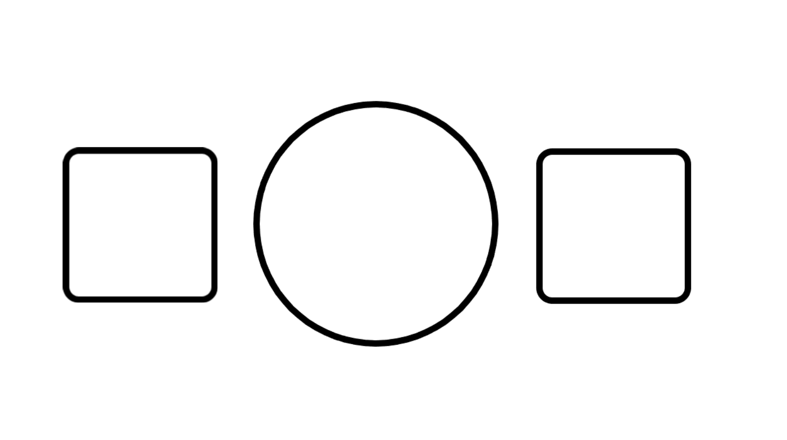

# 登陆界面

- 输入用户名、密码，点击登陆按钮，若不存在该用户或者用户名错误，则提示：无此用户或者密码错误。
- 注册要求输入用户名，密码，上传头像，并检查用户名是否有重复，若有重复则报错，没有错误则注册成功。刚注册的用户积分为0分。
- 登陆成功或者注册成功均跳转到主界面。
- 此时navbar上出现头像。

# 主界面

- 用户通过注册或者登陆以后进入主界面

- 用户可以通过点击椅子进入该桌，同时用户的图标出现在这个座位上。

  

- 用户坐在位置上以后，若其坐在左边，其左边出现“准备”，“退出”两个按钮，若坐在右边则出现在右边

- 双方都点击准备以后，则进入对战界面。（堵塞延迟）

## 可拓展功能

- 在座位有人的情况下，移到其上方可查看其积分。

# 对战界面

- 进入该界面以后，出现石头，剪刀，布三张牌
- 双方用户进行选择以后，通过结果进行判定，若其为平则再来一盘，不为平则胜者先手。
- 进入黑白棋模块
- 
- 在黑白棋模块进行时，若想要认输，则点击认输，将会弹出提示，确认以后退出，用户积分-1
- 若某用户掉线，则该局自动判负，其积分-1,确定以后用弹框提示其他用户，并提供返回大厅的链接。
- 当胜负已分时，弹框通知用户，积分结算，且提供返回的链接。

